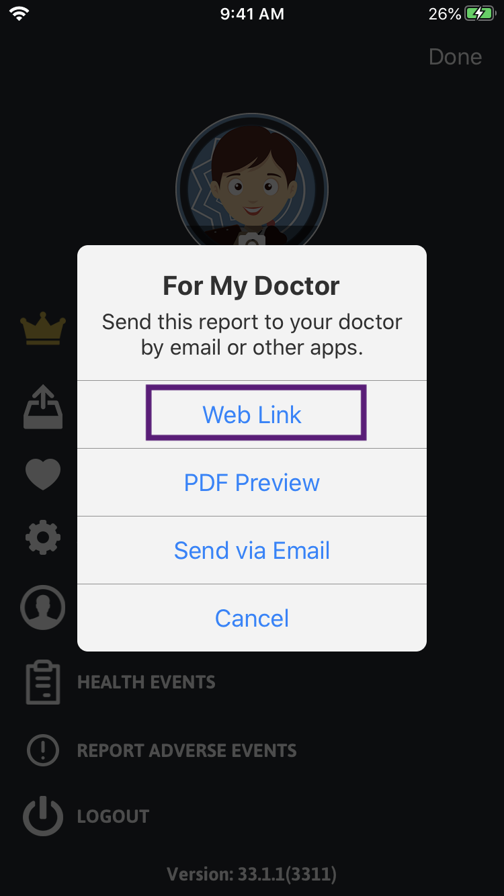

# migraine-buddy-parser
Parser for [Migraine Buddy](https://migrainebuddy.com/)'s exported report html which generates [Migraine Québec's calendar (fr)](https://migrainequebec.com/ressources/calendrier-de-la-migraine/).

## How it works

### 1. Export report HTML from app
Go to the app and export data "For my doctor" for whatever period you wish, including notes and health events as a "Web Link".

   

Save the page HTML into Migraine Buddy Parser's `input` folder.
```bash
curl https://reports.healint.com/mb/MigraineBuddy_XXXXXXXX.html > ~/migraine-buddy-parser/input/report.html
```

### 2. Use tool to generate MigraineQC calendar HTML
Run parser to generate calendar.

```bash
npm start > calendar.html
```
### 3. Done!

